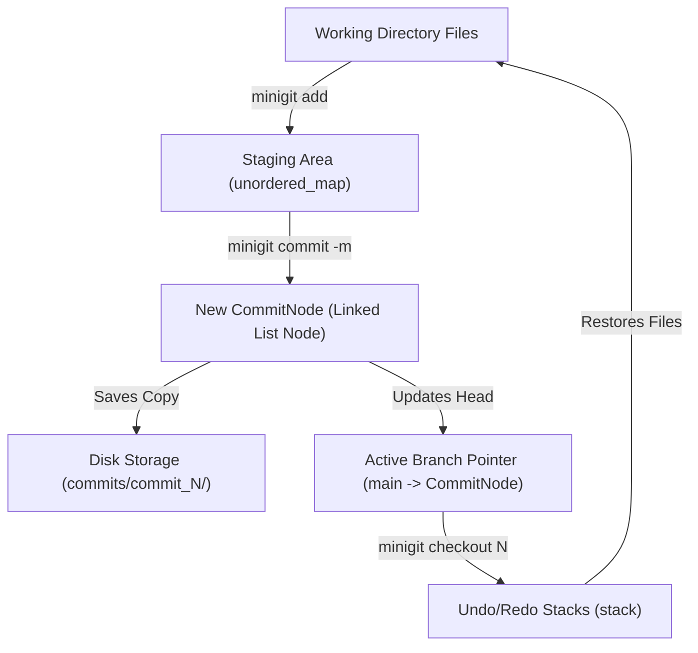

# MiniGit - Lightweight C++ Version Control System 🚀

A high-performance, educational **Version Control System (VCS)** built in modern C++17 alongside an interactive web portfolio and terminal simulator. MiniGit demonstrates core **Data Structures and Algorithms (DSA)** concepts by simulating real-world Git operations like linked-list commit chains, hash-map staging areas, stack-based undo/redo, file diffs, and snapshot tracking.

[](https://en.cppreference.com/w/cpp/17)
[](#-installation)
[](LICENSE)
[](#-interactive-web-portfolio)

---

## 🌟 Key Features

### 🔧 Core Engine Capabilities
- **Commit Chain**: Singly Linked List managing sequential commit history nodes with timestamps & commit messages.
- **Fast Staging Area**: `std::unordered_map` content hash tracking for $O(1)$ file modification checks.
- **Undo / Redo System**: Dual `std::stack` structures allowing seamless traversal across checkout states.
- **File Diffing**: Line-by-line & state comparison between working directory, staging area, and previous commits.
- **Branching Architecture**: Isolated development timelines pointing to commit head pointers.
- **Persistent Snapshots**: Directory-based versioning storing byte-for-byte repository snapshots under `commits/commit_<id>/`.
- **Colored ANSI Output**: Enhanced user-friendly terminal output with status colors across Windows and Unix platforms.

---

## 🏗️ Project Folder Structure

```
Version-Control-System/
├── 📁 src/
│   └── minigit.cpp             # Primary C++ engine implementation (1200+ lines)
│
├── 📁 website/                  # Portfolio website & interactive terminal simulator
│   ├── index.html              # Main responsive landing page
│   ├── demo.html               # Full-screen interactive CLI simulator
│   ├── styles.css              # Modern Classic styling & CSS custom properties
│   └── script.js               # Terminal emulator logic & theme toggles
│
├── 📁 test_files/               # Sample files for CLI testing
│   ├── sample.txt              # Sample text file
│   └── main.cpp                # Sample C++ file
│
├── 📁 downloads/                # Download assets for pre-compiled releases
│   ├── minigit.exe             # Pre-compiled Windows binary executable
│   └── README.txt              # Installation notes
│
├── 📁 commits/                  # Generated snapshot storage (created at runtime)
│
├── 🛠️ Build Scripts & Docs
│   ├── Makefile                # Cross-platform Unix/Linux/macOS Makefile
│   ├── build.bat               # Automated Windows build script
│   ├── README.md               # Main project documentation (this file)
│   ├── PROJECT_STRUCTURE.md    # Detailed architecture documentation
│   ├── PROJECT_SUMMARY.md      # Summary of features & statistics
│   └── FEATURE_VERIFICATION.md # Feature verification logs
└── ⚙️ .gitignore                 # Repository exclusion rules
```

---

## 📐 System Architecture

### 1. Data Flow Architecture


### 2. High-Level Class & Component Design

```
+-----------------------------------------------------------------------------------+
|                                  MiniGit Engine                                   |
+-----------------------------------------------------------------------------------+
|  - head: CommitNode*                                                              |
|  - currentCommit: CommitNode*                                                     |
|  - stagingArea: unordered_map<string, string>  [filename -> content_hash]         |
|  - trackedFiles: vector<string>                                                   |
|  - undoStack: stack<CommitNode*>                                                  |
|  - redoStack: stack<CommitNode*>                                                  |
|  - branches: unordered_map<string, Branch*>    [branch_name -> Branch*]           |
+-----------------------------------------------------------------------------------+
                                         |
                                         v
+-----------------------------------------------------------------------------------+
|                              CommitNode (Linked List)                             |
+-----------------------------------------------------------------------------------+
|  - commitId: int                                                                  |
|  - commitMessage: string                                                          |
|  - timestamp: string                                                              |
|  - fileHashes: unordered_map<string, string>                                      |
|  - next: CommitNode*                                                              |
+-----------------------------------------------------------------------------------+
```

- **`CommitNode` (Singly Linked List Node)**: Represents an immutable commit point in history containing commit ID, message, timestamp, file hash snapshot map, and pointer to `next` node.
- **`Staging Area` (`std::unordered_map`)**: Provides $O(1)$ constant-time lookup for checking staged file modifications prior to committing.
- **`Undo/Redo Stacks` (`std::stack`)**: Tracks commit node pointers during `checkout` switches, enabling seamless $O(1)$ undo and redo history traversal.
- **Snapshot Persistence**: Saves byte-for-byte project copies inside isolated directories (`commits/commit_<id>/`) upon committing and restores them during checkout.

---

## 🔧 Data Structures & Algorithms Breakdown

| Data Structure | Code Symbol | Role in MiniGit Engine |
| :--- | :--- | :--- |
| **Singly Linked List** | [`CommitNode*`](file:///c:/Users/karnv/OneDrive/Desktop/Version%20control%20System/src/minigit.cpp#L44-L53) | Forms the linear commit history graph; each node stores metadata, file hash maps, and a `next` pointer. |
| **Hash Maps** | `unordered_map<string, string>` | Manages staged files and committed hashes (`filename -> hash`) for instant modification lookup. |
| **Stacks** | `stack<CommitNode*>` | Powers `undo` and `redo` operations to traverse checkout history back and forth. |
| **Vectors & Sets** | `vector<string>`, `set<string>` | Tracks active repository files and handles ignored files (`.minigitignore`). |
| **Hashing Algorithm** | `std::hash<string>` | Generates content hashes to detect file modifications without full string comparisons. |

---

## 📦 Installation & Compilation

### Prerequisites
- **C++17 Compatible Compiler**: GCC 7+, Clang 5+, or MSVC 2017+
- **Make** *(Optional, for Linux/macOS build targets)*

### 1. Windows Compilation (Recommended)

Run the automated build script in PowerShell or CMD:
```powershell
.\build.bat
```
*Or compile manually:*
```powershell
g++ -std=c++17 -Wall -Wextra -O2 -o minigit.exe src/minigit.cpp
```
Run the executable:
```powershell
.\minigit.exe
```

### 2. Linux / macOS Compilation

Using `make`:
```bash
make
./minigit
```
*Or compile manually:*
```bash
g++ -std=c++17 -Wall -Wextra -O2 -o minigit src/minigit.cpp
./minigit
```

---

## 🎯 Usage & Command Reference

| Command | Description | Example Usage |
| :--- | :--- | :--- |
| `init` | Initialize a new MiniGit repository | `minigit> init` |
| `add <file>` | Stage a file for the next commit | `minigit> add test_files/sample.txt` |
| `commit -m "msg"` | Save staged changes as a snapshot | `minigit> commit -m "Initial commit"` |
| `log` | View commit history linked list | `minigit> log` |
| `status` | Show repository & staging state | `minigit> status` |
| `diff` | Compare file changes across commits | `minigit> diff` |
| `checkout <id>` | Revert workspace to commit `<id>` | `minigit> checkout 1` |
| `undo` | Undo last checkout navigation | `minigit> undo` |
| `redo` | Redo last undone checkout | `minigit> redo` |
| `help` | Display interactive help menu | `minigit> help` |
| `exit` | Safely exit MiniGit CLI | `minigit> exit` |

---

## 🌐 Interactive Web Portfolio & Simulator

MiniGit comes with a **Modern Classic** portfolio and interactive terminal simulator located in the [`website/`](file:///c:/Users/karnv/OneDrive/Desktop/Version%20control%20System/website) folder.

- **Main Landing Page**: [`website/index.html`](file:///c:/Users/karnv/OneDrive/Desktop/Version%20control%20System/website/index.html) (Features modern typography pairing, DSA breakdowns, responsive sections, and feature cards).
- **Interactive Terminal Simulator**: [`website/demo.html`](file:///c:/Users/karnv/OneDrive/Desktop/Version%20control%20System/website/demo.html) (Test MiniGit commands directly inside your web browser).

---

## 🚀 Recommended Feature Improvements (Roadmap)

To elevate MiniGit to full production parity, the following feature additions are recommended:

1. **SHA-1 / SHA-256 Cryptographic Blob Storage**: Replace standard C++ `std::hash` string hashes with cryptographic SHA object storage to store content blobs in immutable object trees.
2. **3-Way Branch Merging & Conflict Resolution**: Implement 3-way merge algorithms between branch heads and inject standard Git conflict markers (`<<<<<<< HEAD`) when file edits collide.
3. **Stash Stack (`minigit stash`)**: Allow developers to temporarily shelve dirty uncommitted workspace modifications onto a LIFO stack and pop them back later (`stash pop`).
4. **Commit Amending (`commit --amend`)**: Support modifying the tip commit message or updating staged snapshots on the active branch without creating a new node.
5. **SVG / Mermaid Commit Graph Visualizer**: Render real-time interactive commit node DAGs directly in the web UI.

---

## 🌐 Best Places to Deploy

### 1. Portfolio & Web Demo (`website/`)
- **GitHub Pages** *(Recommended #1)*: Free static hosting directly from the repository's `main` branch or `/website` subfolder with SSL & custom domains.
  - **Setup**: Go to `Repository Settings -> Pages -> Source: Deploy from branch (main / website)`.
- **Vercel / Netlify**: Continuous integration and deployment from GitHub with global edge CDN distribution.
  - **Setup**: Run `npx vercel --prod` pointing build directory to `website/`.

### 2. Compiled CLI Binaries (`minigit.exe`)
- **GitHub Releases**: Upload pre-compiled `minigit.exe` (Windows) and Linux executables to GitHub Releases tagged alongside version numbers (e.g. `v1.0.0`).

---

## 📝 License

This project is open-source and licensed under the **MIT License**.